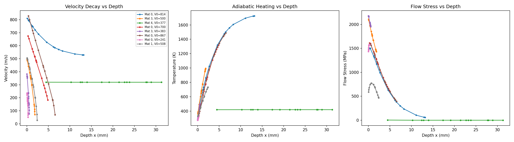
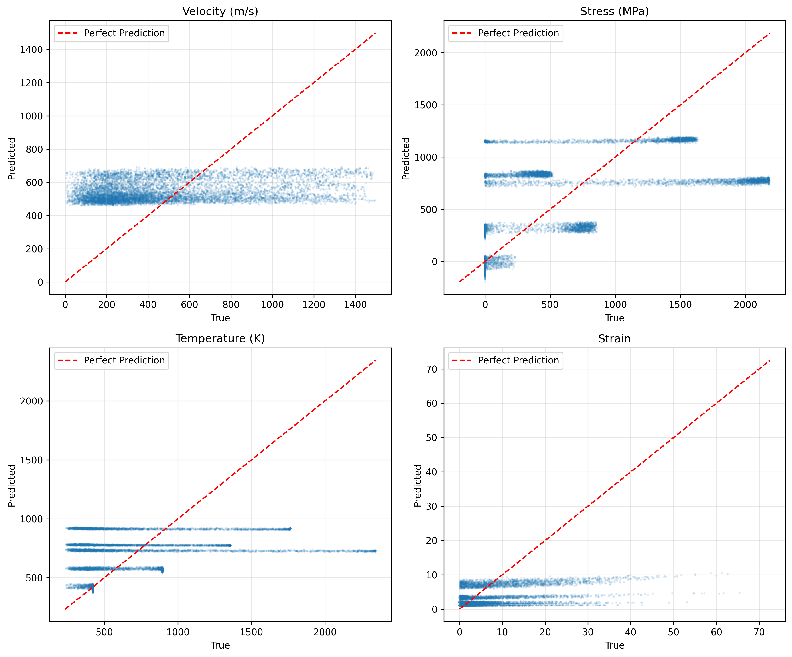
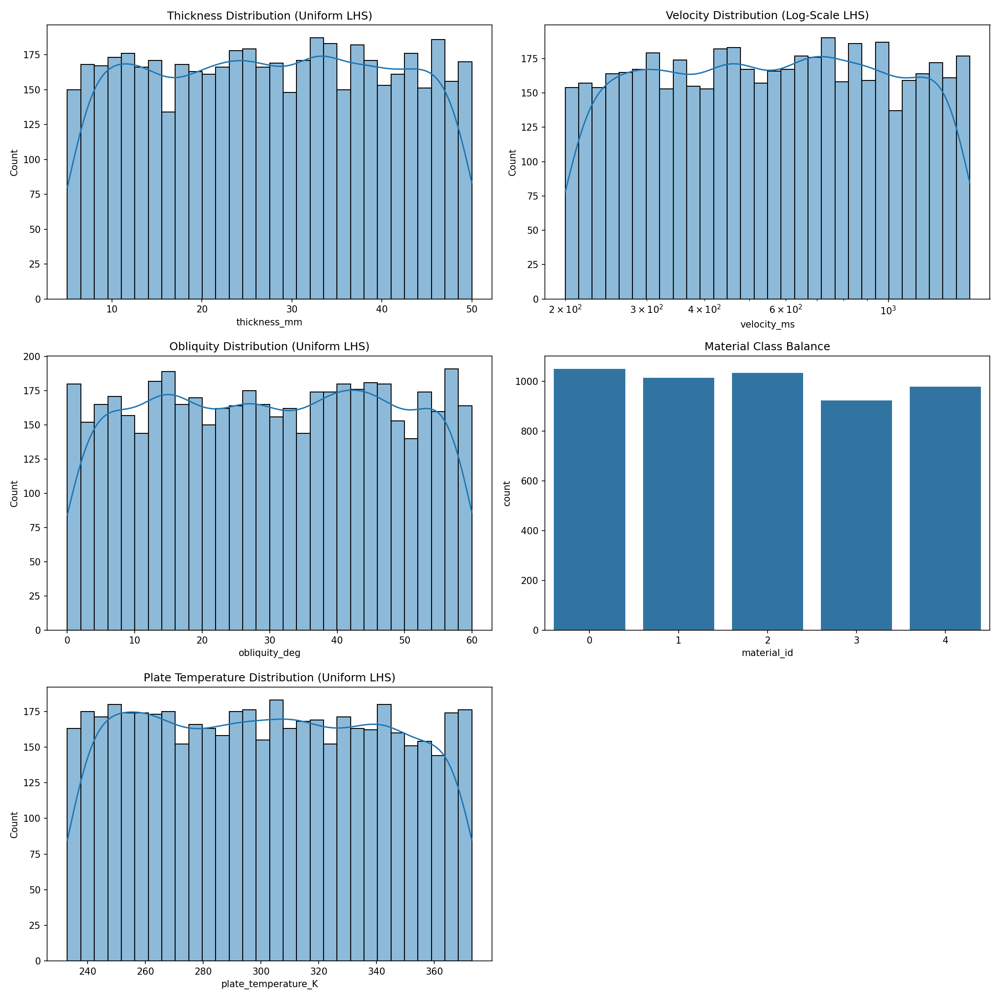

# Ballistic Simulation Engine


A high-speed, physics-based numerical simulation engine designed for rapid ballistic impact analysis and Physics-Informed Neural Network (PINN) dataset generation.

This engine bridges the gap between purely analytical formulations (which lack transient fidelity) and full 3D Finite Element Analysis (which is computationally expensive). By coupling a non-linear ODE solver with dynamic material constitutive models (Johnson-Cook and Cowper-Symonds) and adiabatic shear plug failure mechanisms (Recht-Ipson), the engine predicts the spatiotemporal evolution of temperature, strain, flow stress, and velocity during impact.

## Project Vision & Goals

**1. Solving the "Data Starvation" Problem**

Interns and researchers at defense organizations often lack access to proprietary experimental datasets or classified internal data. This engine is intentionally designed as a **synthetic data generator** to solve this problem. It produces diverse, physics-grounded data spanning the operational envelope, enabling ML experimentation without requiring proprietary datasets.

**2. Long-Term Scalability & PINN-Readiness**

The architecture is deliberately modular, extensible, and research-oriented. The current codebase provides a foundation for advanced ML applications. The extraction of physical ODE residuals makes the engine **PINN-ready**, allowing surrogate modeling, inverse modeling, parameter identification, and uncertainty quantification to be integrated later.

## Features

- **High Performance**: Python numerical kernels are compiled with Numba `@njit` for high-throughput simulation.
- **Physical Models**: Johnson-Cook strain hardening / thermal softening and Cowper-Symonds dynamic strain-rate effects.
- **Ballistic Benchmarking**: Recht-Ipson analytical model for ballistic limits ($V_{50}$) and residual velocities.
- **Numerical Integration**: Time/depth-stepping simulation of transient impact states.
- **PINN Data Pipeline**: Latin Hypercube Sampling (LHS) and chunked Parquet dataset generation.
- **PyTorch Integration**: `BallisticPINNDataset` for normalized ML training data.

---

## Project Structure

- `stage1_part1_johnson_cook.py`: Johnson-Cook constitutive model and material definitions.
- `stage1_part2_cowper_symonds.py`: Cowper-Symonds dynamic strain-rate increase factor (DIF).
- `stage1_part3_recht_ipson.py`: Recht-Ipson analytical benchmark for ballistic limits and residual velocity.
- `simulation.py`: Core time-stepping physics engine.
- `data_gen.py` / `eda.py`: LHS dataset generation and exploratory analysis.
- `pinn_dataloader.py`: PyTorch dataset wrapper for generated Parquet data.
- `physics_residuals.py`: Physical ODE residual calculations for PINN workflows.
- `tests/`: Automated tests for materials, physics, and the data loader.

---

## Requirements

```bash
pip install numpy pandas pyarrow matplotlib seaborn numba torch scipy pytest
```

`torch` is optional for the core simulation but required by the PyTorch dataset pipeline.

## Running Tests

The repository includes automated tests covering the material configuration, physics behavior, and PyTorch data-loader components.

```bash
pytest tests/ -v
```

The same test suite runs automatically in GitHub Actions on pushes and pull requests.

---

## Example Usage

### 1. Running a Single Impact Simulation

```python
from simulation import simulate_trajectory
import matplotlib.pyplot as plt

traj = simulate_trajectory(
    plate_thickness_mm=10.0,
    material_name="RHA_steel",
    bullet_velocity_ms=850.0,
    bullet_mass_g=7.9,
    bullet_diameter_mm=7.62
)

depths = traj["x_mm"]
velocities = traj["V_ms"]

print(f"Simulation completed with {traj['n_points']} active steps.")
print(f"Exit Velocity: {velocities[-1]:.2f} m/s")

plt.plot(depths, velocities)
plt.xlabel("Depth (mm)")
plt.ylabel("Velocity (m/s)")
plt.title("Projectile Velocity vs. Penetration Depth")
plt.show()
```

### 2. Finding the Ballistic Limit ($V_{50}$)

```python
from simulation import simulate_ballistic_impact

res = simulate_ballistic_impact(
    plate_thickness_mm=12.0,
    material_name="aluminium_7075_T6",
    plate_temperature_K=298.0,
    bullet_velocity_ms=900.0,
    bullet_mass_g=7.9,
    bullet_diameter_mm=7.62
)

print(f"Penetrated: {res.penetrated}")
print(f"Residual Velocity: {res.residual_velocity_ms:.2f} m/s")
print(f"Ballistic Limit (V50): {res.ballistic_limit_ms:.2f} m/s")
print(f"Energy Absorbed: {res.energy_absorbed_J:.2f} J")
```

### 3. Loading PINN Data into PyTorch

```python
import torch
from torch.utils.data import DataLoader
from pinn_dataloader import BallisticPINNDataset

dataset = BallisticPINNDataset("pinn_data/train", normalize=True)
dataloader = DataLoader(dataset, batch_size=256, shuffle=True)

x_batch, y_batch = next(iter(dataloader))
print("Input shape:", x_batch.shape)
print("Target shape:", y_batch.shape)
```

## 📊 Sample Results

<p align="center">
  
  
</p>

*Left: simulated trajectory profiles. Right: model-predicted versus simulated values shown as a parity plot.*

<p align="center">
  
</p>

*Latin Hypercube Sampling coverage used for synthetic dataset generation.*

---

## Adding Custom Materials

Materials are dynamically loaded from `materials_config.json`. Add a new material with the required Johnson-Cook and Cowper-Symonds parameters; no source-code modification is required for the material definition.

```json
{
    "titanium_Ti6Al4V": {
        "label": "Titanium Alloy (Ti-6Al-4V)",
        "A": 862.0,
        "B": 331.0,
        "n": 0.34,
        "C": 0.012,
        "m": 0.8,
        "T_melt": 1900.0,
        "rho": 4430.0,
        "E": 114000.0,
        "Cp": 526.0,
        "cs_D": 100000.0,
        "cs_q": 4.0,
        "hardness_HRC": 36.0
    }
}
```

## Known Limitations & Assumptions

> **⚠️ Important Physical Constraints**
> - **Material-Dependent Failure Strain:** Metals and ceramics fail at different strains. The integration respects the `failure_strain` parameter defined in `materials_config.json`. Once $\epsilon > \epsilon_f$, the flow stress drops to zero.
> - **Geometric Strain Rate:** The strain rate is currently simplified to $\dot{\epsilon} = V / (w \sqrt{3})$. This is a macroscopic simplification that future PINN work should account for.
> - **Single-Point Calibration:** The adiabatic shear zone width ($w_{ratio}$) was calibrated against the documented 12 mm RHA Steel $V_{50}$ target. Sweeping thickness or evaluating non-RHA materials may require re-calibration or a more general $w_{ratio}(t,V)$ formulation.
